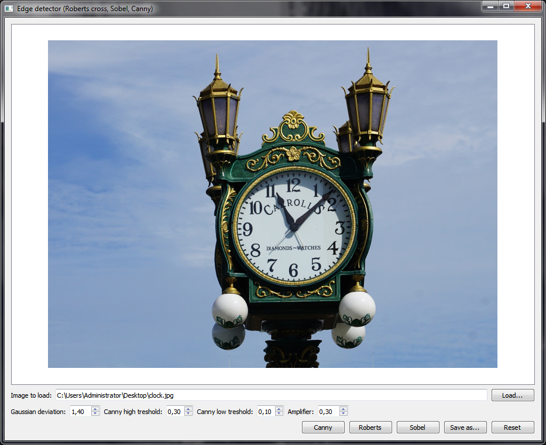
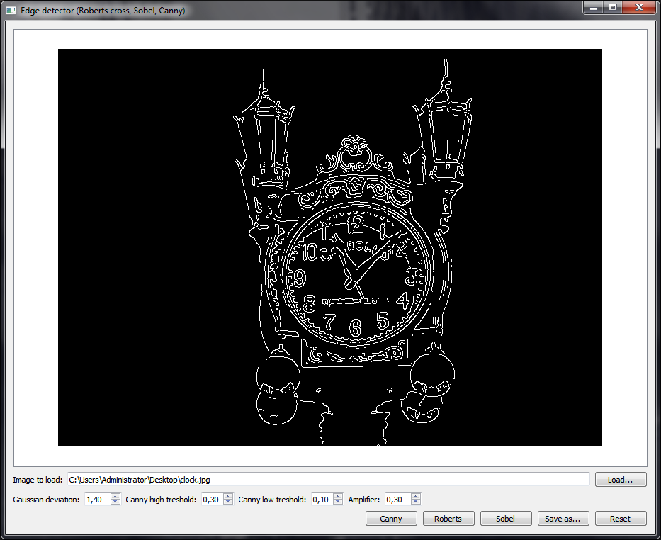
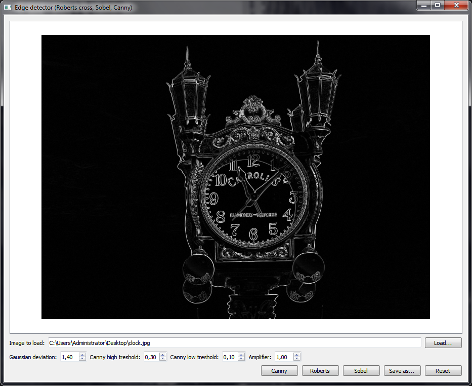
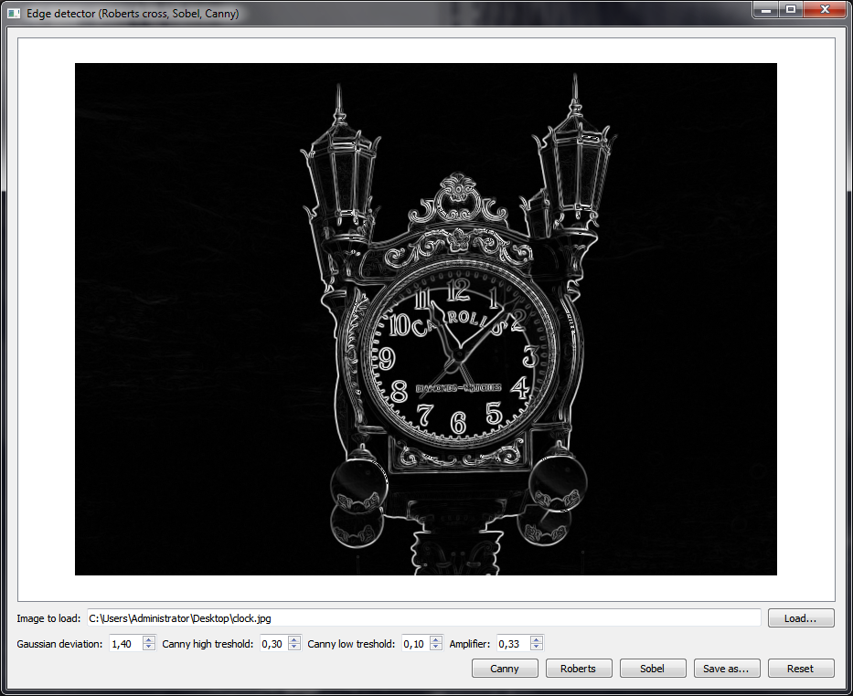

# EdgeDetector
Demonstration of working implementations of the Canny, Sobel, and Roberts cross edge detection algorithms. Written in Qt/C++.
## Download
Download link: [Win32 binary](https://github.com/Extender/EdgeDetector/raw/master/bin/edgedetector-v1.0-bin-win32.zip)
## Screenshots
### Input

### Canny edge detection

### Roberts cross edge detection

### Sobel edge detection

